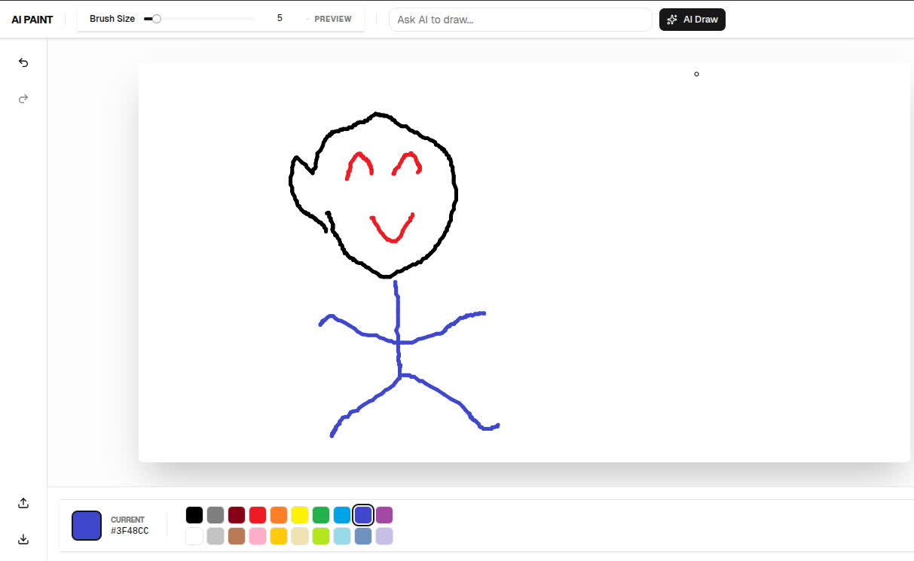
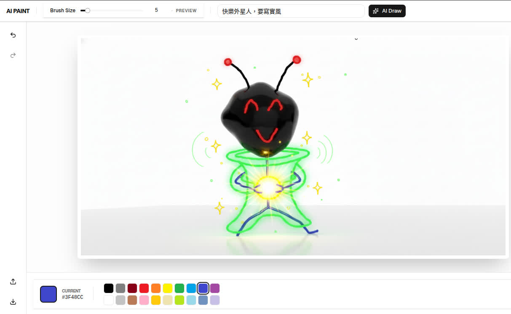
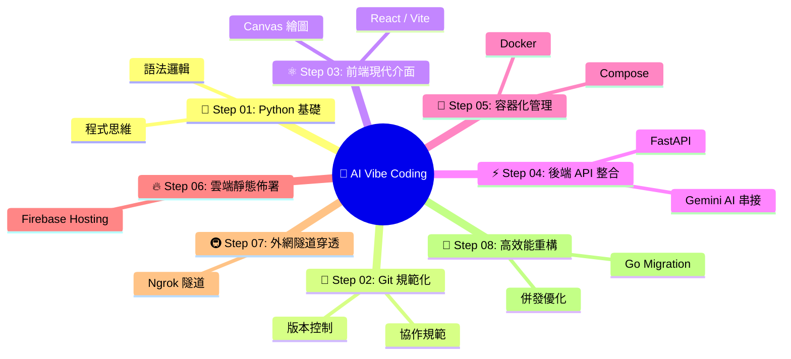
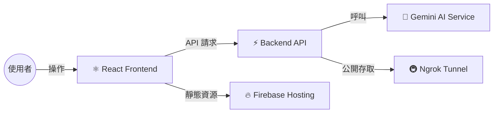

# 🎨 AI Vibe C (Vibe Coding 學習路徑) ✨

此專案是為了幫助 **Vibe Coding** 的學習者，透過實際動手實作一個「AI 繪圖小畫家」，從零開始了解現代化程式開發、容器化與雲端佈署的運作原理。🌈🚀

---

## 🖼️ 專案成果展示 (Showcase)

| 🎨 繪圖介面 (UI) | 🤖 AI 生成結果 (Result) |
| :---: | :---: |
|  |  |

---

## 🧠 學習心智圖 (Learning Mind Map)

---

## 🌐 系統架構 (System Architecture)

---

## 🛠️ 準備工作 (Prerequisites)

在您開始 Step 01 之前，請確保您的開發環境已安裝以下工具：

- [ ] **Python 3.10+** (建議使用 [Miniconda](https://docs.anaconda.com/miniconda/)) 🐍
- [ ] **Node.js 18+** (建議使用 [NVM](https://github.com/nvm-sh/nvm)) ⚛️
- [ ] **Docker & Docker Compose** 🐳
- [ ] **Git** 🐙
- [ ] **Vibe Coding 工具** (例如 [Antigravity](https://github.com/toydogcat/antigravity-extension) 或 [Claude Code](https://docs.anthropic.com/en/docs/agents-and-tools/claude-code)) 🤖

---

## 🚀 學習路線圖 (Roadmap)

> [!TIP]
> 💡 建議您可以依照以下路徑練習，並嘗試將專案主題改為您感興趣的其他功能。

### 01. 🐍 Python 基礎核心 (Python Core)
*   **🤖 Vibe 提示詞建議**：
    > 「請閱讀 `python-example/` 下的程式碼，並用白話文向我解釋這段程式碼是如何運作的？如果我想要新增一個加法功能，我該怎麼改？」

### 02. 🐙 Git 規範化 (Git Init)
*   **🤖 Vibe 提示詞建議**：
    > 「我正在初始化一個 Web 專案，請幫我產出適合 Python (FastAPI) 與 Node.js (Vite) 混合環境的 `.gitignore` 檔案，並解釋為什麼這些檔案需要被忽略。」

### 03. ⚛️ 前端現代化介面 (Frontend Vite)
*   **🤖 Vibe 提示詞建議**：
    > 「請幫我用 React 建立一個簡單的畫布 (Canvas) 組件，包含畫筆顏色選擇、粗細調整以及清空畫布功能。我想要具備現代化的 UI 視覺效果。」

### 04. ⚡ 後端 API 整合 (Backend FastAPI)
*   **🤖 Vibe 提示詞建議**：
    > 「參考現有的前端 Canvas 功能，請幫我用 FastAPI 實作後端 API。我需要一個可以儲存按鈕點擊統計的端點，以及一個串接 Gemini API 進行 AI 繪圖生成的功能。」

### 05. 🐳 容器化管理 (Docker Container)
*   **🤖 Vibe 提示詞建議**：
    > 「請掃描目前的 `frontend/` 與 `backend/` 目錄，分別為它們建立優化過的 `Dockerfile`，並寫一個 `docker-compose.yml` 讓兩個服務可以一鍵同時啟動。」

### 06. 🔥 雲端靜態佈署 (Deploy Firebase)
*   **🤖 Vibe 提示詞建議**：
    > 「我想把 Vite 建置好的 `frontend/dist` 佈署到 Firebase Hosting。請逐步指引我如何設定 `firebase.json`，以及在佈署失敗報錯 [錯誤代碼] 時該如何修復？」

### 07. 🚇 外網隧道穿透 (Tunnel Ngrok)
*   **🤖 Vibe 提示詞建議**：
    > 「我想要一個 Python 腳本來自動啟動 Ngrok 隧道並對接到 8000 通訊埠。腳本需要能從 `.env` 讀取 Token，並在啟動後印出公開的網址。」

### 08. 🐹 高效能重構 (Migration Go)
*   **🤖 Vibe 提示詞建議**：
    > 「我有現成的 Python FastAPI 邏輯，現在想將其重構成 Go (Gin 框架)。請保持原有的 API 定義 (End-points) 不變，協助我遷移代碼並撰寫簡單的測試確保運作正確。」

---

## 🛠️ Vibe Coding 開發建議 💡

1.  **🧠 上下文為王**：在請 AI 修改代碼時，先讓它閱讀 `start/readme.md` 以了解當前步驟的具體要求。
2.  **🎯 指令式引導**：善用「參考現有範例」的力量，避免 AI 產生無謂的幻覺。
3.  **🔍 錯誤排查**：遇到執行錯誤時，直接將 Terminal 的錯誤日誌丟給 AI，通常能快速修復。

---

✨ 祝您在 Vibe Coding 的路上一帆風順！快樂地創造吧！🌈🎨💻
